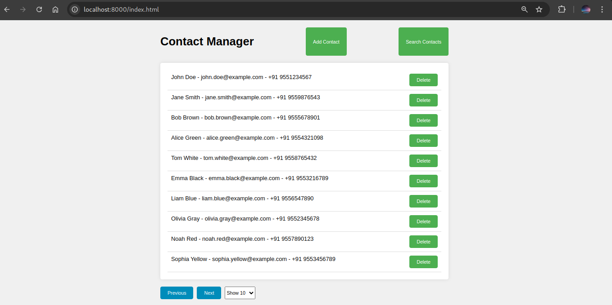
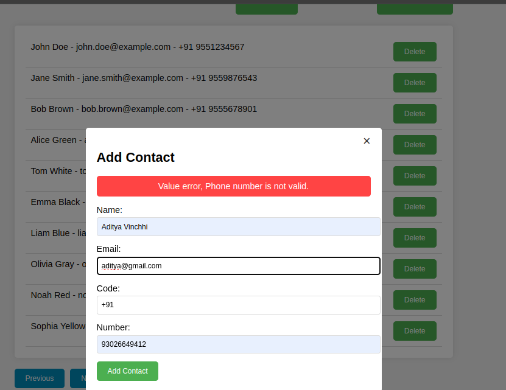
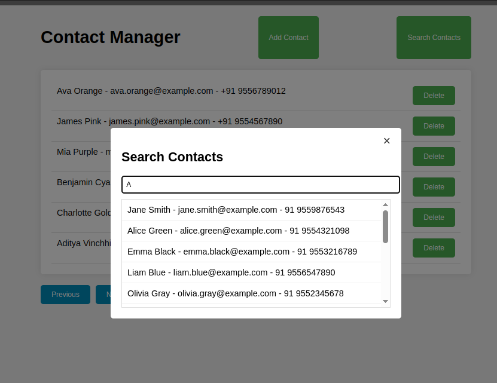

# Contact Manager
This is contact manager web app made using fastapi for server and html,css and javascript for forntend.

API documentation can be access using postman [link](https://github.com/Addaitya/contact_manager)

## Contant of Table
- [File system](#file-system)
- [Setup project](#how-to-setup)
- [Features](#features)
- [Demo images](#demo)

## File System
```
contact_manager
    ├── compose.yaml
    ├── images
    ├── README.md
    ├── requirements.txt
    ├── src
    │   ├── datastore
    │   │   ├── contact.csv
    │   │   └── datastore.py
    │   ├── dockerfile
    │   ├── main.py
    │   ├── routers
    │   │   └── api.py
    │   └── static
    │       ├── index.html
    │       └── style.css
    └── tests
        ├── __init__.py
        └── test_api.py
```

## How to setup
### 1. With docker
1. Make current directory as root directory of the project(i.e. contact_manager) run following command:
```
docker compose up
``` 

2. This will turn on the server at http://localhost:8000/index.html

### Without docker
1. Make current directory as root directory of the project(i.e. contact_manager) 
2. Setup virtual env
3. Install dependencies
```
pip install -r requirements.txt
```
4. Turn on server by running following command:

```
uvicorn src.main:app --port 8000
```
5. This will turn on the server at http://localhost:8000/index.html

## Features
1. Pagenation
2. Email and phone number validation when adding contact
3. Github action setup for automated test cases execution.
4. Storage in csv file.

## Demo
### Home page


### Add Contact


### Search Contact
